# honest-watchdogs

**Monitoring that proves it can fire.**


[](LICENSE)


Six small instruments for the unglamorous parts of running scheduled jobs on a few machines:
launchd and systemd schedules, crash loops, a mirrored directory, a network mount, and the alert
path itself. Python standard library only, no dependencies, Python 3.11+, macOS and Linux.

Each one exists because the obvious way to monitor the thing is wrong in a specific, repeatable
way, and the naive monitor reports green while the failure is happening.


<sub>Real output from `mount-probe` on Linux. The last run points the local positive control at a
directory that does not exist. The probe has not shown it can see a healthy write, so it says
UNKNOWN (exit 3) and does not call the mount broken.</sub>

---

## Contents

- [The core idea](#the-core-idea)
- [The instruments](#the-instruments)
- [Architecture](#architecture)
- [How each instrument decides](#how-each-instrument-decides)
- [Alerts: receipts, not hope](#alerts-receipts-not-hope)
- [Quick start](#quick-start)
- [Configuration](#configuration)
- [Repository layout](#repository-layout)
- [Testing](#testing)
- [Design decisions](#design-decisions)
- [License](#license)

---

## The core idea

A watchdog that cannot show it fires is worse than none: people believe it is watching. Every rule
in this repository comes from that.

**1. A detector that has never fired is not a detector.** Every instrument's tests include
*positive controls*: tests that build the exact failure the instrument exists for and assert that
it fires. They are also *red-on-revert*: remove the guard and a named test fails. At runtime,
`watchdog-alert` is the positive control for the alert path, and `mount-probe` runs its write
probe against local disk before it may call a mount unhealthy.

**2. UNKNOWN is not OK.** Every instrument uses the same exit codes:

| Exit | Meaning |
|---|---|
| `0` | OK: measured, nothing wrong |
| `1` | FINDINGS: measured, something wrong |
| `2` | MISCONFIGURED: the instrument's own configuration is wrong |
| `3` | UNKNOWN: could not measure |


When both are present, UNKNOWN wins (`exitcodes.combine` states the rule, and each instrument
applies it). "I could not look" is never reported as "I looked". An ssh timeout, a failed `ps`, an
unparseable listing, an empty inventory or a corrupt state file gives `3`, never a quiet `0`. A
corrupt state file is left untouched for inspection, and alerts are still sent without latching,
because repeated alerts are better than silence.

**3. Measure the declared schedule, not the observed uptime.** A daemon is meant to run for weeks;
a one-shot job that has been running for sixteen hours is broken. Uptime cannot tell them apart,
but the job's declaration can. Expected periods come from what the job *says* (plist,
`OnCalendar=`), never from what it has been seen doing, because a stuck job would otherwise
enlarge its own bound.

**4. Don't page on a job doing its job.** A timer that fires every minute during business hours
is not overdue at midnight. A job whose contract is to exit non-zero on findings is not
crash-looping. A new timer that has not reached its first elapse has not "never fired". A watch
that pages on correct behaviour gets muted.

**5. Refuse to overwrite good data with truncated data.** Legitimate deletions and bugs look the
same to `rsync --delete`, but they have different *shapes*, and a guard can refuse on shape.

**6. Probe a network mount with a bounded write.** The mount table and a cached listing can both
say "fine" after the server is gone. Only a write has to reach the server, and it has to run in a
separate process with a hard deadline, because a call blocked on a dead mount hangs instead of
raising.

**7. "Sent" is not "delivered".** Every alert attempt appends a receipt saying what the receiver
answered. Latches advance only on successful delivery, so a failed page is retried on the next
run instead of being silenced for the rest of the window.

---

## The instruments

| Instrument | Command | Platform | Detects | How it proves it can fire |
|---|---|---|---|---|
| [Wedge watch](docs/launchd-wedge-watch.md) | `launchd-wedge-watch` | macOS | Scheduled one-shot jobs whose current run has outlived its declared schedule, which halts that schedule | Tests build a sixteen-hour hourly job and a day-old daemon and assert only the first is wedged; a prefix that matches nothing is UNKNOWN, not clean |
| [Crash-loop watch](docs/launchd-crash-loop-watch.md) | `launchd-crash-loop-watch` | macOS (local or over ssh) | Jobs exiting non-zero on repeated run-counter advances inside a window | Positive-control test drives a fixture job to `crash_looping`; an unreachable host is UNKNOWN and pages; reminders re-page an incident that never ends |
| [Timer liveness](docs/systemd-timer-liveness.md) | `systemd-timer-liveness` | Linux (local or over ssh) | systemd timers that have stopped firing, or are active and have never fired | Positive-control tests for an ancient `LastTrigger` (exit 1) and for an active timer that is past due and has never fired |
| [Guarded mirror](docs/guarded-mirror.md) | `guarded-mirror` | macOS, Linux | Source changes shaped like data loss (bulk deletion, index truncation) before rsync propagates them | Refuses the run and leaves the previous mirror byte-for-byte intact; tests cover a wipe that happens *during* the copy |
| [Mount probe](docs/mount-probe.md) | `mount-probe` | macOS, Linux | A mount that is in the mount table but not serving I/O | Runs its bounded write on local disk first (runtime positive control); a failed control gives UNKNOWN |
| [Alerts](docs/alerts.md) | `watchdog-alert` | macOS, Linux | Delivery failures on the alert path itself | `watchdog-alert` sends one real alert and exits 1 if any sink failed; every attempt leaves a receipt |

The other four instruments and `watchdog-alert` send alerts through the shared `alerts`
module. `mount-probe` sends none: it reports through its exit code and a JSON line, so
the scheduler that runs it decides what to do with a failure.

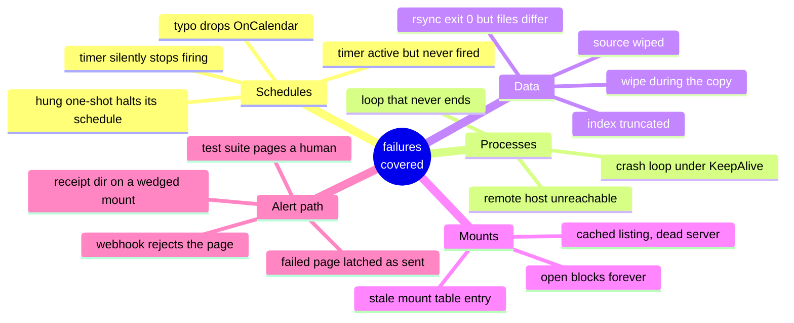

---

## Architecture

Every instrument separates **collection** (anything that touches the machine) from
**classification** (pure functions of what was collected). Every external command goes through
one module-level function that the tests replace with a fake, so the whole suite runs on any
POSIX machine without launchd, systemd or a remote host.

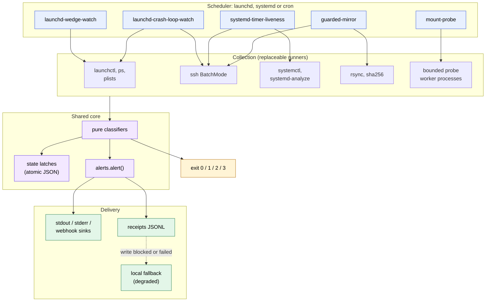

The shared modules are small. `exitcodes` holds the convention, `_state` reads and writes latch
files (a corrupt file raises instead of silently becoming `{}`), and `alerts` holds the data model
and the sinks.

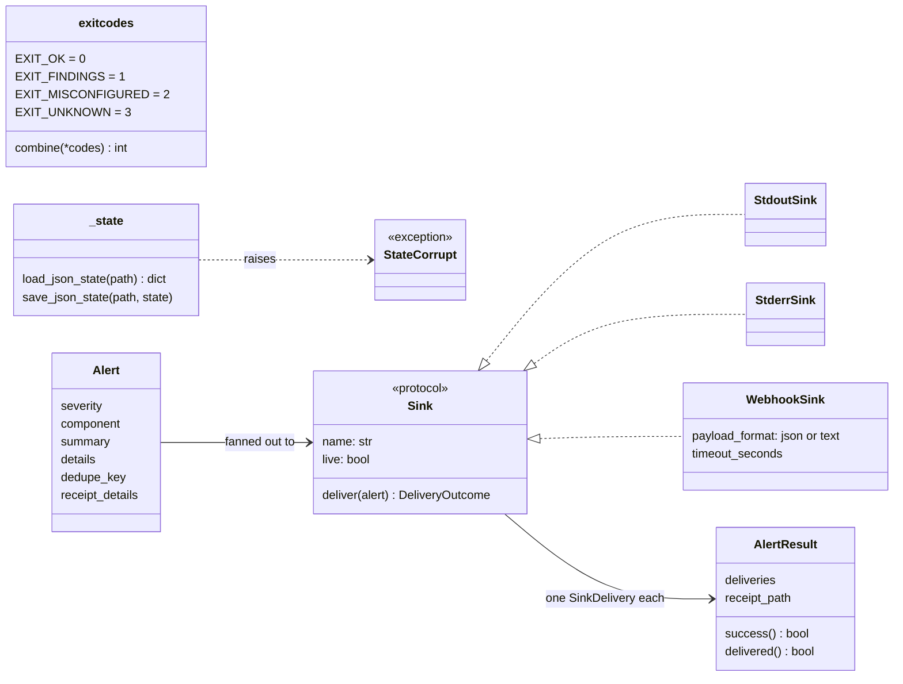

---

## How each instrument decides

### Wedge watch: a hung one-shot halts its schedule, silently

launchd will not start a second instance of a job while one is running, so a hung scheduled job
stops its schedule, while `launchctl list` keeps reporting the last *finished* run's exit status 0.
The watch classifies each running job by its plist, never by its label or uptime.

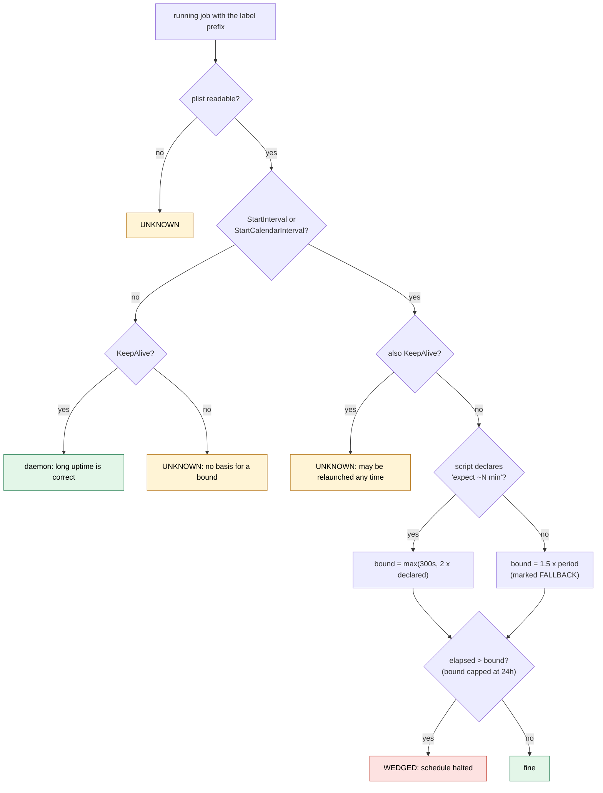

A job that `ps` cannot measure is UNKNOWN rather than dropped, and zero *loaded* jobs matching the
prefix is UNKNOWN, so a typo in `--label-prefix` cannot read as a clean survey.
[Full page](docs/launchd-wedge-watch.md).

### Crash-loop watch: evidence, not a single sample

A non-zero last exit code is not a crash loop. The unit of evidence is a **distinct advance of
launchd's `runs` counter** with a positive exit code; `--threshold` (default 3) of them inside
`--window-seconds` (default 600) is a loop.

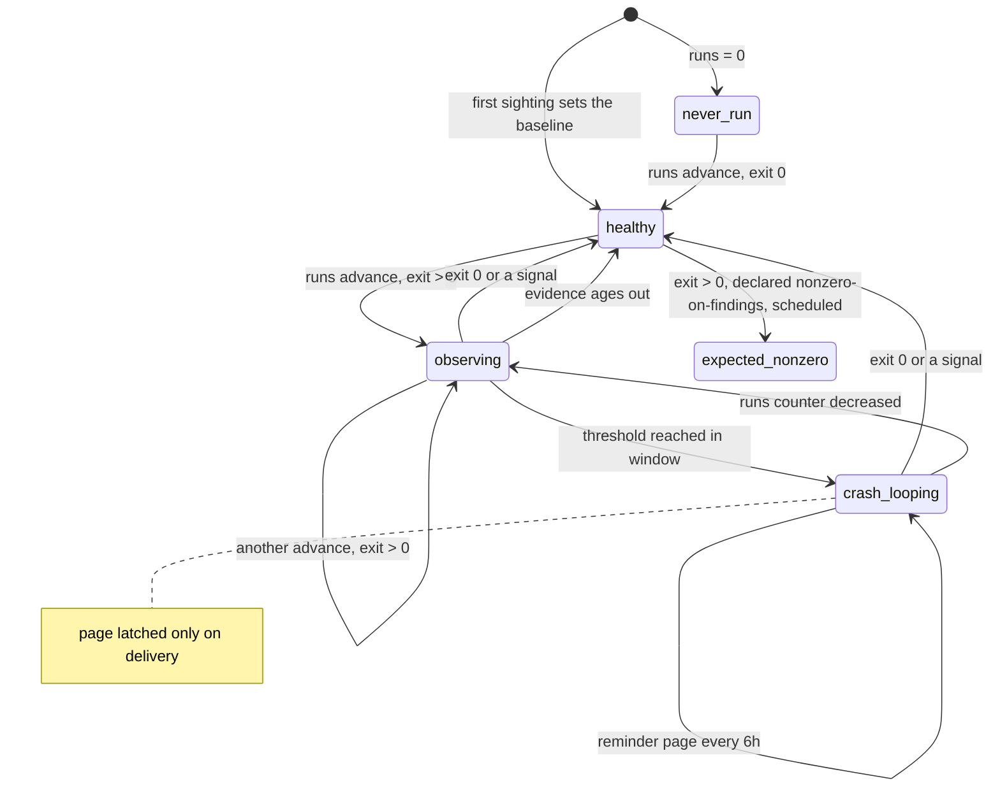

A signal (a deliberate `launchctl kickstart -k` sends SIGTERM) ends the pattern. A job declared
with `--nonzero-findings-label` is `expected_nonzero` only if launchd shows it has a schedule. A
job or host that cannot be read is `unknown`, and a failed ssh tick keeps that host's evidence so
an intermittent host can still reach the threshold. [Full page](docs/launchd-crash-loop-watch.md).

### Timer liveness: overdue against the declared calendar

"Last fired more than 2x the interval ago" pages all weekend for a `Mon..Fri 09:30` timer. This
checker derives cadence from the declaration, keeps the longest declared gap, and confirms every
overdue candidate by evaluating the calendar *from the last trigger*.

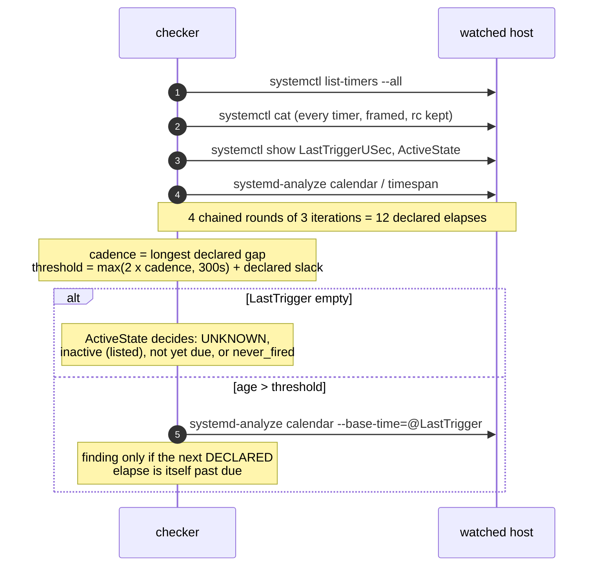

An `OnCalendar=` that cannot be parsed is UNKNOWN, not "fine", and the re-resolution step can
only remove a false alarm: if it fails, the finding stands.
[Full page](docs/systemd-timer-liveness.md).

### Guarded mirror: refuse on shape

A legitimate delete is one file, occasionally two, with an edit to the directory's index file.
A bug is many files at once with the index untouched, or the index truncated. The mirror refuses
the second shape, and copies through staging so a wipe *during* the copy cannot reach the live
mirror either.

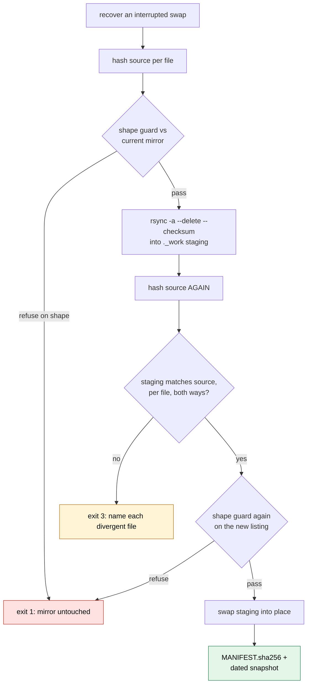

The guard refuses when the source is empty but the mirror is not, when deletions exceed
`--max-deletions` (default 2), when any deletion comes without an index edit, or when the index
is deleted or shrinks by more than `--max-index-shrink` lines (default 2).

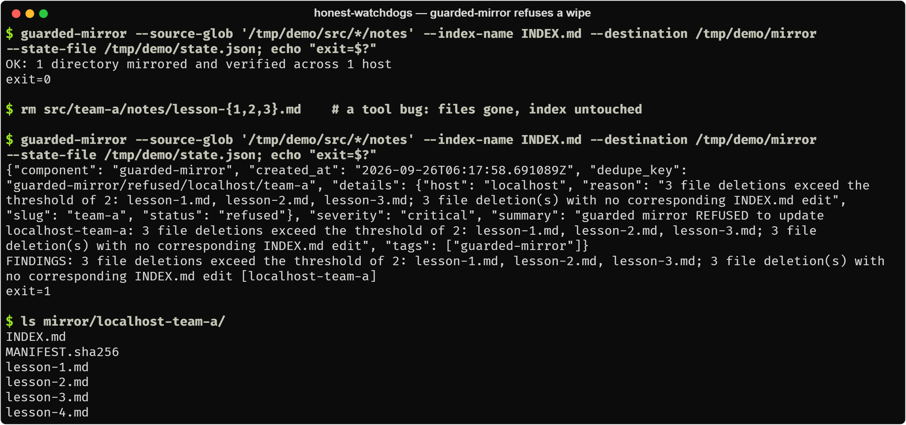

[Full page](docs/guarded-mirror.md).

### Mount probe: a bounded write, with a positive control

Every operation runs in a fresh interpreter in its own process group, SIGKILLed at a hard
deadline. The local control runs first, through the same machinery.

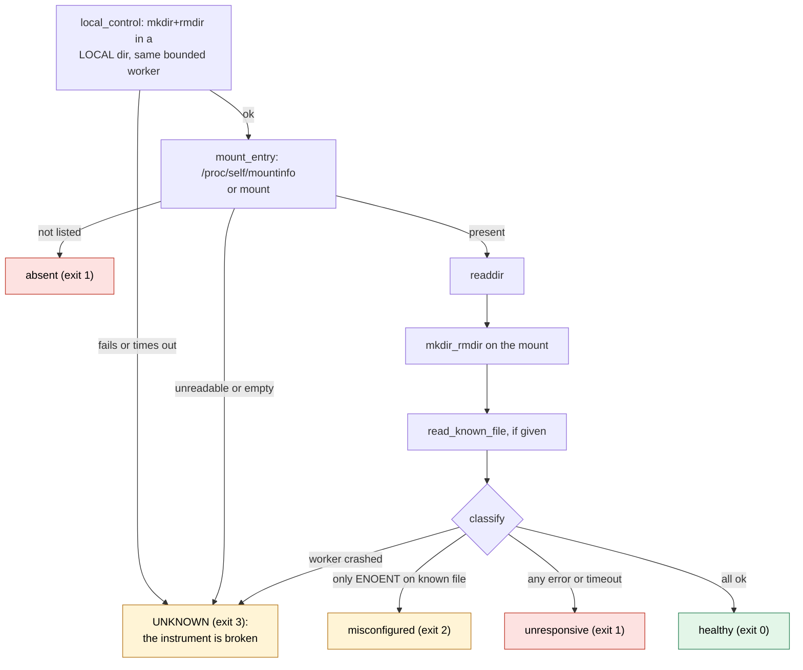

Remediation (`--remediate --mount-command ...`) is opt-in and bounded. It re-probes before every
destructive step and refuses on any verdict it cannot trust. A missing known file is
`misconfigured`, not `unresponsive`, so it can never trigger a force-unmount.
[Full page](docs/mount-probe.md).

---

## Alerts: receipts, not hope

`watchdog-alert` is the positive control for the alert path: it sends one alert through the
configured sinks and exits 0 only if every sink delivered. Run it before you trust any detector
that depends on it.

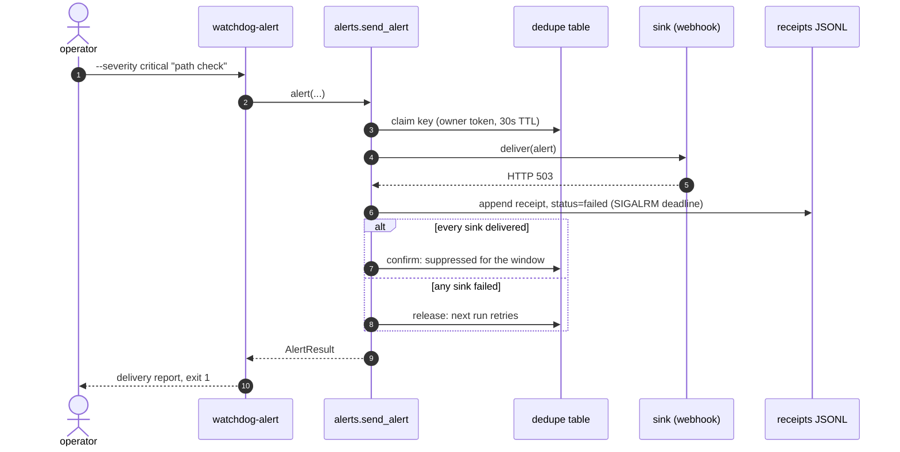


A dedupe key moves through three states. Only full delivery confirms it, so a failed page cannot
suppress the next attempt:

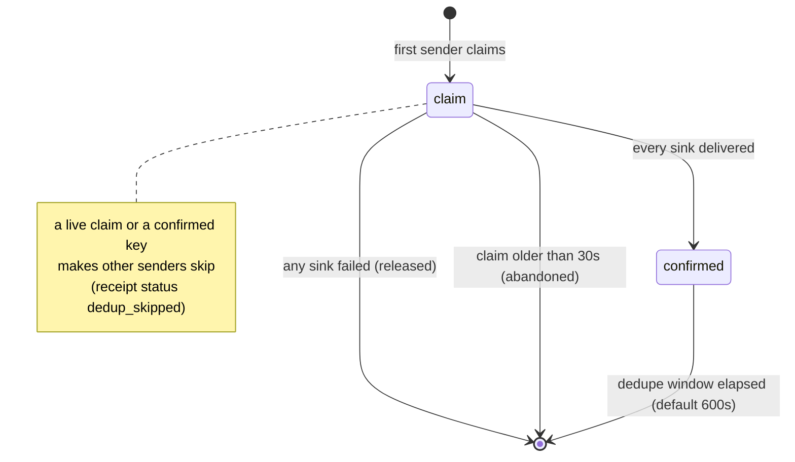

Above the library, the instruments keep their own latches (`--reminder-seconds`, default six
hours) that also advance only on delivery. The receipt write is bounded by `SIGALRM`; if it blocks
or fails, the receipt goes to a local fallback directory marked `receipt_degraded` rather than
hanging the watchdog or being dropped. Under pytest, live sinks are forced to dry-run with a loud
stderr message unless `HONEST_WATCHDOGS_ALLOW_LIVE=1`. [Full page](docs/alerts.md).

---

## Quick start

```bash
git clone https://github.com/JoshSimerman/honest-watchdogs.git && cd honest-watchdogs
python3 -m venv .venv && .venv/bin/pip install -e . pytest
.venv/bin/python -m pytest -q
```

Prove the alert path first. With no configuration, alerts go to stderr as JSON lines:

```bash
.venv/bin/watchdog-alert --severity warn "alert path check"; echo "exit $?"
```

Point it at a webhook (any endpoint that accepts a JSON POST):

```bash
export WATCHDOG_WEBHOOK_URL=https://hooks.example.com/your-endpoint
export WATCHDOG_WEBHOOK_FORMAT=text     # {"text": "..."}; the default "json" sends every field
.venv/bin/watchdog-alert --severity info "hello from honest-watchdogs"; echo "exit $?"
```

Then run the instruments (activate the venv, or prefix `.venv/bin/`):

```bash
# macOS: scheduled jobs whose label starts with com.example.
launchd-wedge-watch --label-prefix com.example.
launchd-crash-loop-watch --label-prefix com.example. --show-all
launchd-crash-loop-watch --label-prefix com.example. --host other-mac --remote-only

# Linux, ideally from a different machine than the one being checked
systemd-timer-liveness --host backup-server

# macOS or Linux: a mount, and a guarded mirror
mount-probe --mount-point /mnt/share --known-file README.txt
guarded-mirror --hosts localhost,laptop --destination /mnt/share/mirrors --dry-run   # check only
guarded-mirror --hosts localhost,laptop --destination /mnt/share/mirrors
```

They are one-shot by design: each run measures, alerts, records state and exits with the verdict.
Run them from launchd, systemd or cron. Every command has `--help`.

## Configuration

Everything host-specific is a flag or an environment variable; nothing names a machine.

| Variable | Used by | Meaning |
|---|---|---|
| `WATCHDOG_ALERT_SINKS` | alerts | Comma list of `stdout`, `stderr`, `webhook`. Default: `webhook` if a URL is set, else `stderr` |
| `WATCHDOG_WEBHOOK_URL` / `_FORMAT` / `_TIMEOUT` | alerts | Webhook target, `json` or `text`, seconds (default 5) |
| `WATCHDOG_RECEIPT_DIR` | alerts | Receipt JSONL directory (default `~/.local/state/honest-watchdogs/receipts`) |
| `WATCHDOG_FALLBACK_RECEIPT_DIR` | alerts | Local directory for degraded receipts (default `~/.cache/honest-watchdogs/receipts-degraded`) |
| `WATCHDOG_DEDUP_WINDOW_SECONDS` / `WATCHDOG_DEDUP_STATE` | alerts | Dedupe window (default 600, `0` disables), and a file for cross-process dedupe |
| `WATCHDOG_LABEL_PREFIX` | launchd watches | Label prefix to watch (or `--label-prefix`) |
| `WATCHDOG_NONZERO_FINDINGS_LABELS` | crash-loop watch | Comma list of periodic labels that exit non-zero to report findings |
| `WATCHDOG_MIRROR_DESTINATION` | guarded-mirror | Mirror root (or `--destination`) |
| `WATCHDOG_MOUNT_POINT` | mount-probe | Mount point (or `--mount-point`) |
| `HONEST_WATCHDOGS_ALLOW_LIVE=1` | alerts | Allow live sinks under pytest, deliberately |
| `HONEST_WATCHDOGS_SUPPRESS_LIVE=1` | alerts | Suppress live sinks (staging, CI) |

State files default to `~/.local/state/honest-watchdogs/`.

## Repository layout

```text
honest_watchdogs/
  exitcodes.py          the 0/1/2/3 convention and its precedence
  _state.py             atomic JSON latch files; corrupt state raises, never resets
  alerts.py             Alert, sinks, receipts, dedupe; the watchdog-alert CLI
  wedge_watch.py        launchd-wedge-watch
  crash_loop_watch.py   launchd-crash-loop-watch
  timer_liveness.py     systemd-timer-liveness
  guarded_mirror.py     guarded-mirror
  mount_probe.py        mount-probe (and its bounded worker entry point)
tests/                  one file per module; conftest keeps alerts hermetic
docs/                   one page per instrument, DESIGN_DECISIONS.md, images/
```

## Testing

```bash
.venv/bin/python -m pytest -q
```

The suite passes on Linux with Python 3.11, 3.12 and 3.13. The tests run no
`launchctl`, `systemctl` or `ssh`: those calls go through functions the tests replace, and the
fakes match exact command strings, so a change in what an instrument sends fails a test. Tests that
need a blocking syscall use a real one (a FIFO, a sleeping subprocess); one test uses a real local
`rsync` and is skipped without it. The package is POSIX-only (`alerts` imports `fcntl`), so the
suite does not run on native Windows.

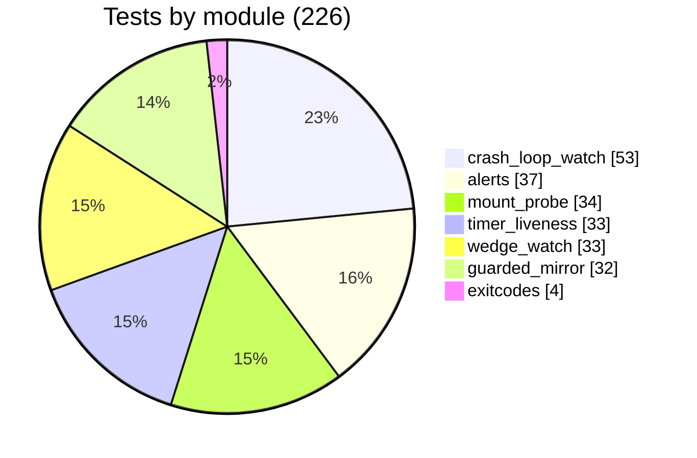

Test names read as requirements. A selection of the positive controls and refusals:


## Design decisions

[docs/DESIGN_DECISIONS.md](docs/DESIGN_DECISIONS.md) records each rule as an ADR: the context, the
decision, what it costs, and what I would revisit. In short:

| ADR | Decision |
|---|---|
| 001 | One exit-code convention, with UNKNOWN distinct from OK |
| 002 | Positive controls and red-on-revert tests are part of the instrument |
| 003 | Expected periods come from the declaration, never from observation |
| 004 | Suppress false alarms by modelling the schedule, not by raising thresholds |
| 005 | Alert until it is over, and only latch on delivery |
| 006 | Receipts are mandatory, bounded, and never dropped |
| 007 | A test suite must not be able to page a human |
| 008 | The guarded mirror refuses on shape |
| 009 | Probe mounts with a bounded write in a separate process |
| 010 | Standard library only; every external command behind a replaceable function |

## License

Copyright (c) 2026 Josh Simerman. Licensed under the GNU Affero General Public License v3.0 or later. See [LICENSE](LICENSE).
