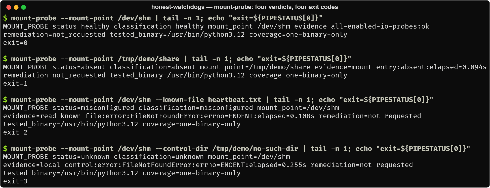
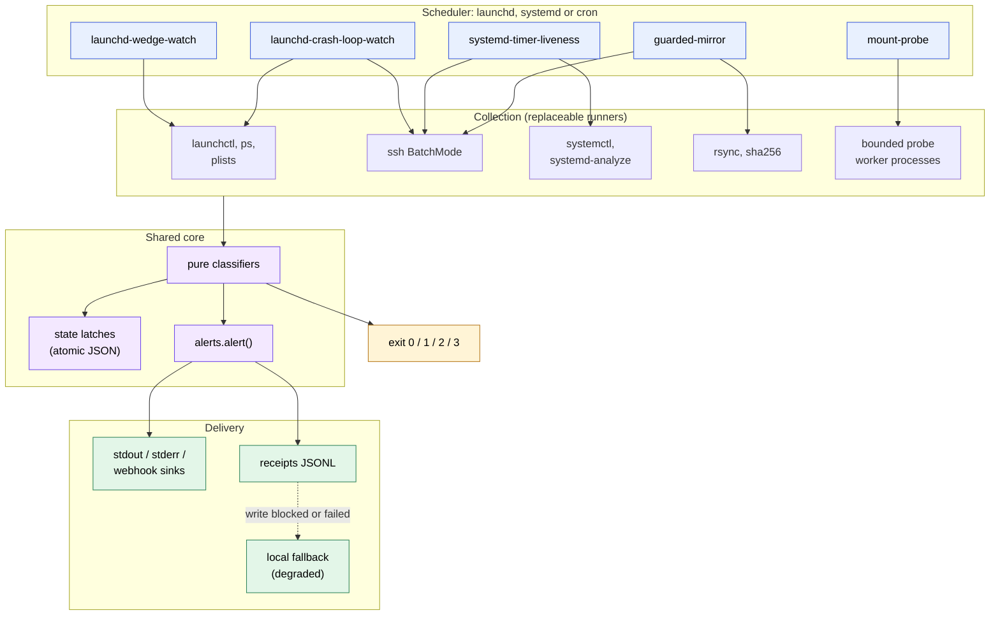
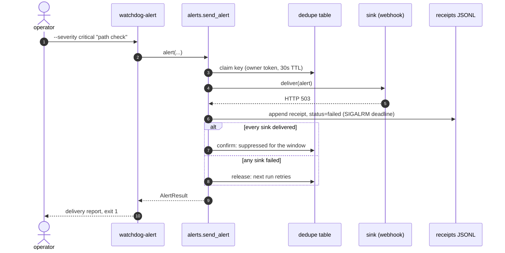
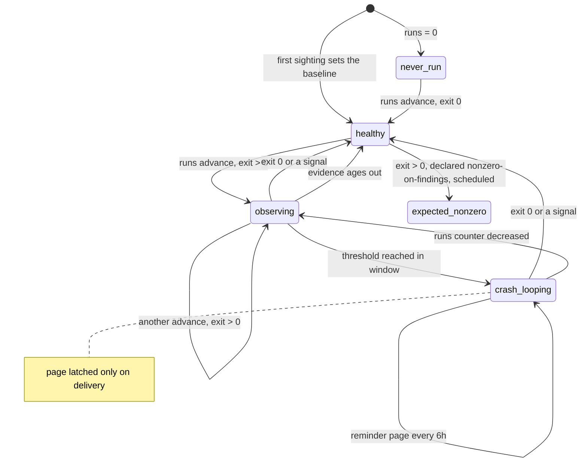
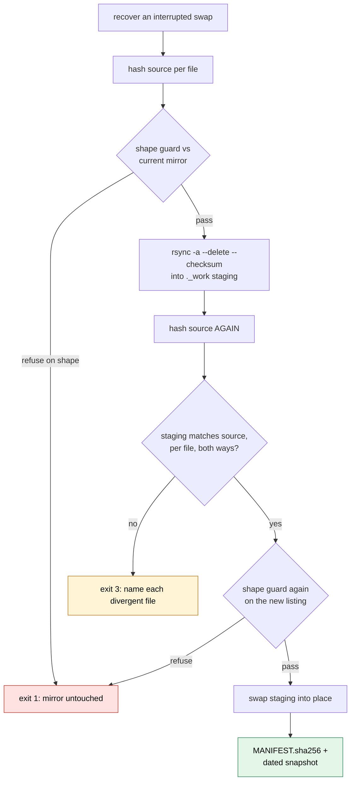

# honest-watchdogs

**Monitoring that proves it can fire.**

[](https://github.com/JoshSimerman/honest-watchdogs/actions/workflows/ci.yml)

[](LICENSE)


Six small instruments for the unglamorous parts of running scheduled jobs on a few machines:
launchd and systemd schedules, crash loops, a mirrored directory, a network mount, and the alert
path itself. Python standard library only, no dependencies, Python 3.11+, macOS and Linux.



<sub>Real output from `mount-probe` on Linux. The last run points the local positive control at a
directory that does not exist, so the probe says UNKNOWN (exit 3) instead of blaming the mount.</sub>

## The core idea

A watchdog that cannot show it fires is worse than none, because people believe it is watching.
So every instrument ships with *positive controls*: tests that build the exact failure it exists
for and fail if the guard is removed, plus runtime checks where they fit (`watchdog-alert` for the
alert path, a local write before `mount-probe` judges a mount). "Could not measure" is its own
exit code (3, UNKNOWN) and is never folded into OK. Expected behaviour comes from what a job
*declares* (plist, `OnCalendar=`), never from what it has been seen doing, and an alert counts
only when the receiver acknowledged it. The full principles are in
[docs/REFERENCE.md](docs/REFERENCE.md#principles).

## Quick start

```bash
git clone https://github.com/JoshSimerman/honest-watchdogs.git && cd honest-watchdogs
python3 -m venv .venv && .venv/bin/pip install -e . pytest
.venv/bin/python -m pytest -q
```

Prove the alert path first. With no configuration, alerts go to stderr as JSON lines; set a
webhook (any endpoint that accepts a JSON POST) and run it again:

```bash
.venv/bin/watchdog-alert --severity warn "alert path check"; echo "exit $?"
export WATCHDOG_WEBHOOK_URL=https://hooks.example.com/your-endpoint
export WATCHDOG_WEBHOOK_FORMAT=text     # {"text": "..."}; the default "json" sends every field
.venv/bin/watchdog-alert --severity info "hello from honest-watchdogs"; echo "exit $?"
```

Then run the instruments (activate the venv, or prefix `.venv/bin/`). Each is one-shot: it
measures, alerts, records state and exits with the verdict, so schedule it from launchd, systemd
or cron. Every command has `--help`.

```bash
launchd-wedge-watch --label-prefix com.example.                      # macOS
launchd-crash-loop-watch --label-prefix com.example. --host other-mac --remote-only
systemd-timer-liveness --host backup-server                          # Linux, from another machine
mount-probe --mount-point /mnt/share --known-file README.txt
guarded-mirror --hosts localhost,laptop --destination /mnt/share/mirrors --dry-run   # check only
```

Exit codes are shared: `0` OK, `1` findings, `2` misconfigured, `3` UNKNOWN (outranks findings).
Configuration is flags and `WATCHDOG_*` environment variables; see
[docs/REFERENCE.md](docs/REFERENCE.md#configuration).

## The instruments

| Instrument | Command | Platform | Detects | How it proves it can fire |
|---|---|---|---|---|
| [Wedge watch](docs/launchd-wedge-watch.md) | `launchd-wedge-watch` | macOS | Scheduled one-shot jobs whose current run has outlived its declared schedule, which halts that schedule | Tests build a sixteen-hour hourly job and a day-old daemon and assert only the first is wedged; a prefix that matches nothing is UNKNOWN, not clean |
| [Crash-loop watch](docs/launchd-crash-loop-watch.md) | `launchd-crash-loop-watch` | macOS (local or over ssh) | Jobs exiting non-zero on repeated run-counter advances inside a window | Positive-control test drives a fixture job to `crash_looping`; an unreachable host is UNKNOWN and pages; reminders re-page an incident that never ends |
| [Timer liveness](docs/systemd-timer-liveness.md) | `systemd-timer-liveness` | Linux (local or over ssh) | systemd timers that have stopped firing, or are active and have never fired | Positive-control tests for an ancient `LastTrigger` (exit 1) and for an active timer that is past due and has never fired |
| [Guarded mirror](docs/guarded-mirror.md) | `guarded-mirror` | macOS, Linux | Source changes shaped like data loss (bulk deletion, index truncation) before rsync propagates them | Refuses the run and leaves the previous mirror byte-for-byte intact; tests cover a wipe that happens *during* the copy |
| [Mount probe](docs/mount-probe.md) | `mount-probe` | macOS, Linux | A mount that is in the mount table but not serving I/O | Runs its bounded write on local disk first (runtime positive control); a failed control gives UNKNOWN |
| [Alerts](docs/alerts.md) | `watchdog-alert` | macOS, Linux | Delivery failures on the alert path itself | `watchdog-alert` sends one real alert and exits 1 if any sink failed or any receipt was lost; every sink is attempted, and every attempt leaves a receipt |

`mount-probe` sends no alerts itself: it reports through its exit code and a JSON line. The others
alert through the shared `alerts` module.

## Architecture

Every instrument separates **collection** (anything that touches the machine) from
**classification** (pure functions of what was collected). Every external command goes through
one replaceable function, so the whole suite runs on any POSIX machine without launchd, systemd
or a remote host.



### Alerts: receipts, not hope

`watchdog-alert` is the positive control for the alert path: it sends one alert through every
configured sink and exits 0 only if every sink delivered and every receipt was written. A
failure on one sink, or in its receipt, never stops the others. A dedupe key is confirmed only on
full delivery, so a failed page is retried on the next run. [More](docs/alerts.md).



### Crash-loop watch: evidence, not a single sample

The unit of evidence is a distinct advance of launchd's `runs` counter with a positive exit code;
`--threshold` (default 3) of them inside `--window-seconds` (default 600) is a loop.
[More](docs/launchd-crash-loop-watch.md).



### Guarded mirror: refuse on shape

A legitimate delete is one file, occasionally two, with an edit to the index file. A bug is many
files at once with the index untouched, or the index truncated. The mirror refuses the second
shape and copies through staging, so a wipe *during* the copy cannot reach the live mirror
either. [More](docs/guarded-mirror.md).



## Design decisions

Each rule is recorded as an ADR with its context, decision, cost and what I would revisit.

| ADR | Decision |
|---|---|
| [001](docs/DESIGN_DECISIONS.md#adr-001-one-exit-code-convention-with-unknown-distinct-from-ok) | One exit-code convention, with UNKNOWN distinct from OK |
| [002](docs/DESIGN_DECISIONS.md#adr-002-positive-controls-and-red-on-revert-tests-are-part-of-the-instrument) | Positive controls and red-on-revert tests are part of the instrument |
| [003](docs/DESIGN_DECISIONS.md#adr-003-expected-periods-come-from-the-declaration-never-from-observation) | Expected periods come from the declaration, never from observation |
| [004](docs/DESIGN_DECISIONS.md#adr-004-suppress-false-alarms-by-modelling-the-schedule-not-by-raising-thresholds) | Suppress false alarms by modelling the schedule, not by raising thresholds |
| [005](docs/DESIGN_DECISIONS.md#adr-005-alert-until-it-is-over-and-only-latch-on-delivery) | Alert until it is over, and only latch on delivery |
| [006](docs/DESIGN_DECISIONS.md#adr-006-receipts-are-mandatory-bounded-and-never-silently-dropped) | Receipts are mandatory, bounded, and never silently dropped |
| [007](docs/DESIGN_DECISIONS.md#adr-007-a-test-suite-must-not-be-able-to-page-a-human) | A test suite must not be able to page a human |
| [008](docs/DESIGN_DECISIONS.md#adr-008-the-guarded-mirror-refuses-on-shape) | The guarded mirror refuses on shape |
| [009](docs/DESIGN_DECISIONS.md#adr-009-probe-mounts-with-a-bounded-write-in-a-separate-process) | Probe mounts with a bounded write in a separate process |
| [010](docs/DESIGN_DECISIONS.md#adr-010-standard-library-only-every-external-command-behind-a-replaceable-function) | Standard library only; every external command behind a replaceable function |

## Documentation

| Page | Covers |
|---|---|
| [launchd-wedge-watch.md](docs/launchd-wedge-watch.md) | Hung one-shot jobs: period sources, declared runtimes, classification |
| [launchd-crash-loop-watch.md](docs/launchd-crash-loop-watch.md) | Crash-loop evidence, reminders, remote hosts, state |
| [systemd-timer-liveness.md](docs/systemd-timer-liveness.md) | Declared cadence, empty `LastTrigger`, calendar confirmation |
| [guarded-mirror.md](docs/guarded-mirror.md) | The shape guard, staging, verification, snapshots |
| [mount-probe.md](docs/mount-probe.md) | Bounded probes, the local positive control, opt-in remediation |
| [alerts.md](docs/alerts.md) | Sinks, receipts, dedupe, the fallback path |
| [REFERENCE.md](docs/REFERENCE.md) | Principles, exit codes, shared modules, configuration, layout, testing |
| [DESIGN_DECISIONS.md](docs/DESIGN_DECISIONS.md) | The ten ADRs in full |

## Testing

CI runs the suite on Ubuntu and macOS with Python 3.11–3.13. The tests run no `launchctl`,
`systemctl` or `ssh`; those calls go through functions the tests replace with fakes that match
exact command strings. The package is POSIX-only, so it does not run on native Windows.
[More](docs/REFERENCE.md#testing).

## About this repository

This is a v1 snapshot exported from a private monorepo. Its history was squashed into a single
initial commit, so there is no earlier history to browse here.

## License

Copyright (c) 2026 Josh Simerman. Licensed under the GNU Affero General Public License v3.0 or later. See [LICENSE](LICENSE).
