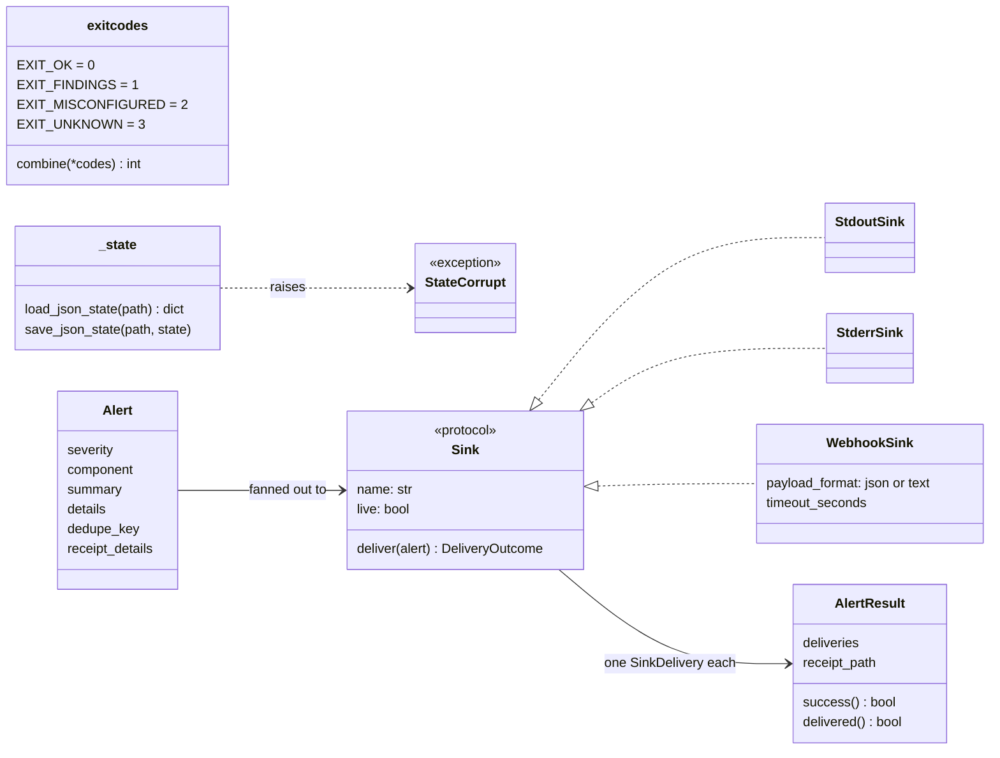
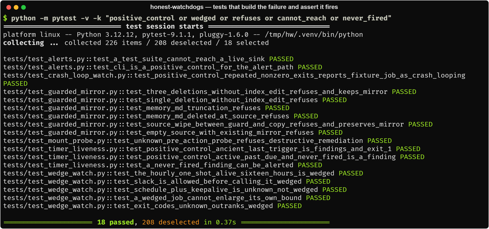

# Reference

The material behind the README: the principles, the exit-code convention, the shared modules,
configuration, repository layout and testing. Each instrument's own page covers its flags and
classification in detail.

- [Principles](#principles)
- [Exit codes](#exit-codes)
- [Shared modules](#shared-modules)
- [Configuration](#configuration)
- [Repository layout](#repository-layout)
- [Testing](#testing)

---

## Principles

A watchdog that cannot show it fires is worse than none: people believe it is watching. Every rule
in this repository comes from that. [DESIGN_DECISIONS.md](DESIGN_DECISIONS.md) records each one
as an ADR.

**1. A detector that has never fired is not a detector.** Every instrument's tests include
*positive controls*: tests that build the exact failure the instrument exists for and assert that
it fires. They are also *red-on-revert*: remove the guard and a named test fails. At runtime,
`watchdog-alert` is the positive control for the alert path, and `mount-probe` runs its write
probe against local disk before it may call a mount unhealthy.

**2. UNKNOWN is not OK.** "I could not look" is never reported as "I looked". See
[Exit codes](#exit-codes).

**3. Measure the declared schedule, not the observed uptime.** A daemon is meant to run for weeks;
a one-shot job that has been running for sixteen hours is broken. Uptime cannot tell them apart,
but the job's declaration can. Expected periods come from what the job *says* (plist,
`OnCalendar=`), never from what it has been seen doing, because a stuck job would otherwise
enlarge its own bound.

**4. Don't page on a job doing its job.** A timer that fires every minute during business hours
is not overdue at midnight. A job whose contract is to exit non-zero on findings is not
crash-looping. A new timer that has not reached its first elapse has not "never fired". A watch
that pages on correct behaviour gets muted.

**5. Refuse to overwrite good data with truncated data.** Legitimate deletions and bugs look the
same to `rsync --delete`, but they have different *shapes*, and a guard can refuse on shape.

**6. Probe a network mount with a bounded write.** The mount table and a cached listing can both
say "fine" after the server is gone. Only a write has to reach the server, and it has to run in a
separate process with a hard deadline, because a call blocked on a dead mount hangs instead of
raising.

**7. "Sent" is not "delivered".** Every alert attempt appends a receipt saying what the receiver
answered, and a failure on one sink or its receipt never stops the others. Latches advance only on successful delivery, so a failed page is retried on the next
run instead of being silenced for the rest of the window.

---

## Exit codes

Every instrument uses the same exit codes:

| Exit | Meaning |
|---|---|
| `0` | OK: measured, nothing wrong |
| `1` | FINDINGS: measured, something wrong |
| `2` | MISCONFIGURED: the instrument's own configuration is wrong |
| `3` | UNKNOWN: could not measure |


When both are present, UNKNOWN wins (`exitcodes.combine` states the rule, and each instrument
applies it). An ssh timeout, a failed `ps`, an unparseable listing, an empty inventory or a
corrupt state file gives `3`, never a quiet `0`. A corrupt state file is left untouched for
inspection, and alerts are still sent without latching, because repeated alerts are better than
silence.

Two instruments refine this, and their pages say how: the crash-loop watch exits `0` after a
crash loop it paged successfully (it is itself a launchd job), and `watchdog-alert` exits `1`
when any sink failed.

---

## Shared modules

Every instrument separates **collection** (anything that touches the machine) from
**classification** (pure functions of what was collected). Every external command goes through
one module-level function that the tests replace with a fake, so the whole suite runs on any
POSIX machine without launchd, systemd or a remote host.

The shared modules are small. `exitcodes` holds the convention, `_state` reads and writes latch
files (a corrupt file raises instead of silently becoming `{}`), and `alerts` holds the data model
and the sinks ([alerts.md](alerts.md)).



`launchd-wedge-watch`, `launchd-crash-loop-watch`, `systemd-timer-liveness`, `guarded-mirror` and
`watchdog-alert` send alerts through `alerts`. `mount-probe` sends none: it reports through its
exit code and a JSON line, so the scheduler that runs it decides what to do with a failure.

---

## Configuration

Everything host-specific is a flag or an environment variable; nothing names a machine.

| Variable | Used by | Meaning |
|---|---|---|
| `WATCHDOG_ALERT_SINKS` | alerts | Comma list of `stdout`, `stderr`, `webhook`. Default: `webhook` if a URL is set, else `stderr` |
| `WATCHDOG_WEBHOOK_URL` / `_FORMAT` / `_TIMEOUT` | alerts | Webhook target, `json` or `text`, seconds (default 5) |
| `WATCHDOG_RECEIPT_DIR` | alerts | Receipt JSONL directory (default `~/.local/state/honest-watchdogs/receipts`) |
| `WATCHDOG_FALLBACK_RECEIPT_DIR` | alerts | Local directory for degraded receipts (default `~/.cache/honest-watchdogs/receipts-degraded`) |
| `WATCHDOG_DEDUP_WINDOW_SECONDS` / `WATCHDOG_DEDUP_STATE` | alerts | Dedupe window (default 600, `0` disables), and a file for cross-process dedupe |
| `WATCHDOG_LABEL_PREFIX` | launchd watches | Label prefix to watch (or `--label-prefix`) |
| `WATCHDOG_NONZERO_FINDINGS_LABELS` | crash-loop watch | Comma list of periodic labels that exit non-zero to report findings |
| `WATCHDOG_MIRROR_DESTINATION` | guarded-mirror | Mirror root (or `--destination`) |
| `WATCHDOG_MOUNT_POINT` | mount-probe | Mount point (or `--mount-point`) |
| `HONEST_WATCHDOGS_ALLOW_LIVE=1` | alerts | Allow live sinks under pytest, deliberately |
| `HONEST_WATCHDOGS_SUPPRESS_LIVE=1` | alerts | Suppress live sinks (staging, CI) |

State files default to `~/.local/state/honest-watchdogs/`. Every command has `--help`.

---

## Repository layout

```text
honest_watchdogs/
  exitcodes.py          the 0/1/2/3 convention and its precedence
  _state.py             atomic JSON latch files; corrupt state raises, never resets
  alerts.py             Alert, sinks, receipts, dedupe; the watchdog-alert CLI
  wedge_watch.py        launchd-wedge-watch
  crash_loop_watch.py   launchd-crash-loop-watch
  timer_liveness.py     systemd-timer-liveness
  guarded_mirror.py     guarded-mirror
  mount_probe.py        mount-probe (and its bounded worker entry point)
tests/                  one file per module; conftest keeps alerts hermetic
docs/                   one page per instrument, DESIGN_DECISIONS.md, REFERENCE.md, images/
```

---

## Testing

```bash
.venv/bin/python -m pytest -q
```

CI runs the suite on Ubuntu and macOS with Python 3.11–3.13. The tests run no `launchctl`,
`systemctl` or `ssh`: those calls go through functions the tests replace, and the fakes match
exact command strings, so a change in what an instrument sends fails a test. Tests that need a
blocking syscall use a real one (a FIFO, a sleeping subprocess); one test uses a real local
`rsync` and is skipped without it. The package is POSIX-only (`alerts` imports `fcntl`), so the
suite does not run on native Windows.

Test names read as requirements. A selection of the positive controls and refusals:


