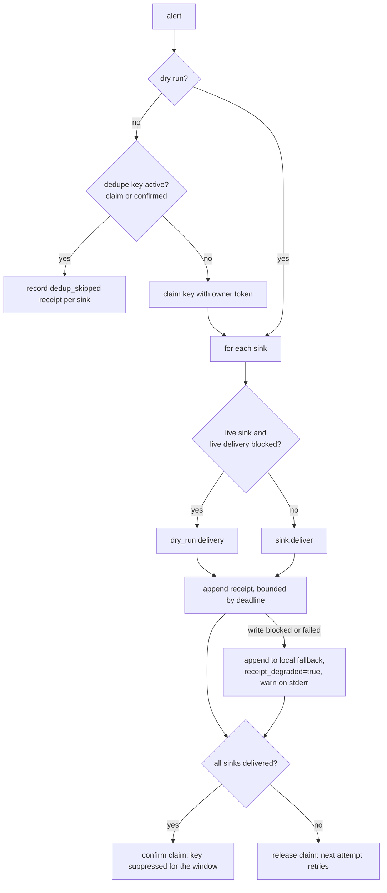

# Alerts

`honest_watchdogs.alerts` is the delivery layer every instrument uses. It is also a command,
`watchdog-alert`, which sends one alert through the configured sinks: run it before you trust any
detector that depends on it. It prints its delivery report to stderr, or to stdout with `--json`,
and exits 0 when every sink delivered, 1 when any failed, 2 when the configuration is invalid.

## What it guarantees

| Guarantee | Mechanism |
|---|---|
| Every attempt leaves evidence | One JSONL receipt line per sink per alert, in `<receipt_dir>/<YYYY-MM-DD>-alerts.jsonl` |
| "Sent" is distinguished from "delivered" | A receipt's `status` is `delivered` only when the sink acknowledged (for a webhook: HTTP 2xx). Otherwise `failed`, with `failure_reason` and `http_status` |
| A wedged receipt directory cannot hang the watchdog | The receipt write runs under a `SIGALRM` deadline; on timeout or `OSError` it goes to a local fallback directory with `receipt_degraded: true` and the intended path |
| A receipt is never dropped | The deadline changes the destination, never whether to record |
| A failed page stays retryable | Dedupe keys are claimed, confirmed only when every sink delivered, released otherwise |
| A crashed sender cannot suppress a key for long | Claims expire after `CLAIM_TTL_SECONDS` (30s) |
| A test suite cannot page a human | Under pytest, live sinks are forced to dry-run with a loud stderr message, unless `HONEST_WATCHDOGS_ALLOW_LIVE=1` |
| Secrets in webhook URLs stay out of logs | Failure reasons name the exception type, never the URL |
| A corrupt dedupe file cannot suppress alerts | An unparseable `WATCHDOG_DEDUP_STATE` file is copied to `<file>.corrupt`, reported on stderr, and replaced by an empty table: the failure direction is *sending* |

## Flow



## Sinks

A sink is any object with `name: str`, `live: bool` and `deliver(alert) -> DeliveryOutcome`.

- `StdoutSink`, `StderrSink`: one JSON line per alert. Not live.
- `WebhookSink(url, payload_format="json" | "text", timeout_seconds=5, headers=None)`: a POST.
  `json` sends the alert's fields (`severity`, `component`, `summary`, `details`, `dedupe_key`,
  `tags`, `created_at`). `text` sends `{"text": "SEVERITY [component] summary"}`, a shape many
  chat webhooks accept. Live.

Write your own for anything else (a pager API, a message queue): return
`DeliveryOutcome(success=False, failure_reason=...)` on failure rather than raising. A sink that
raises is recorded as a failed delivery, not a crash.

## Receipts

```json
{"timestamp": "2030-01-01T09:00:01Z", "alert_created_at": "2030-01-01T09:00:00Z",
 "severity": "critical", "component": "systemd-timer-liveness",
 "summary": "timer backup.timer on db1 is overdue: ...", "tags": ["systemd", "timer-liveness"],
 "details": null, "sink": "webhook", "sink_live": true, "status": "failed", "success": false,
 "dry_run": false, "dedup_skipped": false, "http_status": 503, "failure_reason": "HTTP 503",
 "dedupe_key": "systemd-timer-liveness/overdue/db1/backup.timer", "source": "honest-watchdogs"}
```

Receipts are dated by the **attempt** time, not the alert's creation time, so a stale or
mis-dated alert still lands in today's file where someone will look.

`details` is delivered to sinks but **not** persisted. To persist context, pass
`receipt_details=`; only scalars survive (strings truncated to 256 characters, nested values
dropped). Receipts tend to be kept longer and read more widely than alerts.

## Design notes

**Why SIGALRM and not a thread?** A thread cannot interrupt a blocked `open()`, and a subprocess
per receipt is too expensive for the alert path. `SIGALRM` interrupts the syscall on the main
thread. Off the main thread the write runs unbounded; that limit is documented rather than
hidden.

**Why is the fallback triggered by a write and not an existence check?** Some permission layers
allow metadata operations while denying content. `path.exists()` returns True under exactly the
failure the fallback is for. Only attempting the write can tell you.

**Why does a dedupe skip count as `success`?** Callers latch on `result.success`. Inside the
dedupe window the condition was already delivered, so latching is correct. Use
`result.delivered` when you need to know that *this* call reached every sink.

**Why is dry-run `success`?** So a watchdog run with alerts suppressed still behaves like a
normal run. Dry-run never confirms a dedupe key, so it cannot consume the window of a real page.
