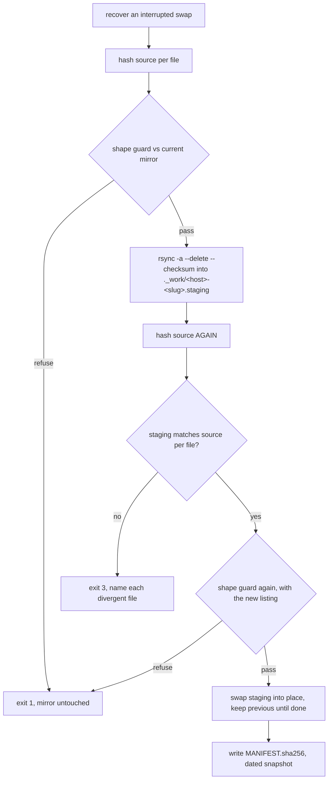

# Guarded mirror

`guarded-mirror` mirrors a set of directories, from this machine and others over ssh, into one
destination with `rsync`, and refuses any run whose changes look like data loss rather than
editing. **macOS and Linux**; needs `rsync`, and `ssh` for remote hosts.

```bash
guarded-mirror --destination /mnt/share/mirrors                            # this machine, default glob
guarded-mirror --hosts localhost,laptop --destination /mnt/share/mirrors
guarded-mirror --destination /backups/notes --source-glob '/srv/teams/*/notes' --index-name INDEX.md
```

Exit: `0` everything mirrored and verified, `1` a guard refused at least one directory (its
previous mirror is untouched), `2` bad arguments, `3` a host, listing, copy or verification could
not be completed.

## What it mirrors

Every directory matching `--source-glob` on every host in `--hosts`. The default,
`~/.claude/projects/*/memory` with index `MEMORY.md`, mirrors the per-project memory directories
of AI coding agents, where an agent both adds lessons and deletes ones it finds were wrong. Any
directory with an index file works.

Each match lands in `<destination>/<host>-<slug>/`, where the slug is what the glob's wildcards
matched (`.../projects/web-app/memory` gives `web-app`). Discovery is by glob, never a fixed
list: directories move, and a fixed list silently stops covering the one that moved. A host with
no matches is UNKNOWN, not "nothing to do".

## The shape guard

A legitimate deletion and a bug look identical to `rsync --delete`. They differ in shape:

| Legitimate | Bug |
|---|---|
| one file deleted, occasionally two | many files deleted at once |
| the index file edited to drop its entry | index untouched |
| index shrinks by a line or two | index truncated or deleted |

The run is **refused** for a directory, and its previous mirror left byte-for-byte intact, when:

- the source is empty but the mirror is not;
- deletions exceed `--max-deletions` (default 2);
- any deletion comes with no change to the index file;
- the index file was deleted;
- the index shrank by more than `--max-index-shrink` lines (default 2).

The cost of a wrong refusal is one stale day. The cost of a wrong propagation is the data.

## Pipeline



Details that each close a specific hole:

- **Staging, not the live mirror.** The guard's listing is stale the moment it is fetched. If
  the source is wiped between the check and the copy, `--delete` must not reach the live mirror.
  The source is re-listed after the copy, and that listing is what the guard and the
  verification use.
- **Verification by effect, both ways.** Every file in the staged copy is re-hashed and compared
  per file against the source, including extra files. `rsync` exiting 0 is not evidence.
- **Normalized hashes.** `sha256sum` (Linux), `shasum -a 256` (macOS) and `openssl` print
  differently; output is parsed into `(hash, path)` pairs, and an unrecognized line is an error,
  never a silently shorter listing.
- **`--checksum`.** Without it rsync picks files by size and mtime, and an edit that preserves
  both would never be copied: the mirror would stay stale and fail verification forever.
- **Crash-safe swap.** Staging and the previous mirror live under a reserved `._work/`
  directory that no mirror name can collide with. A run killed between the two renames leaves
  `previous` in place, and the next run restores it **before** any guard runs; otherwise it would
  see no mirror and let every guard pass.
- **Snapshots outside the rsync target.** `snapshots/<host>-<slug>/<YYYY-MM-DD>/` is written by
  copy-then-rename (a half-copied snapshot looks whole) and never pruned by this tool. A mirror
  with any delete path, however guarded, must not be the only copy.

## Alerting

Refusals page at `critical`, unknowns at `warn`, with host-keyed dedupe
(`guarded-mirror/<kind>/<host>/<slug>`), a reminder interval, and a latch that advances only on
delivery.

- `--no-alert` mirrors as usual but sends no alerts and writes no state file.
- `--dry-run` lists every source and runs the shape guard against the current mirror, then stops:
  it copies nothing, writes nothing (not even the destination directory), and sends no alerts.
  A run that would be refused still exits 1.

A state file that exists but cannot be parsed is exit 3: it is left untouched, and alerts are
sent without latching until it is fixed.

The mirror root gets a `README.md` explaining what the directory is and is not, for whoever finds
it later.
