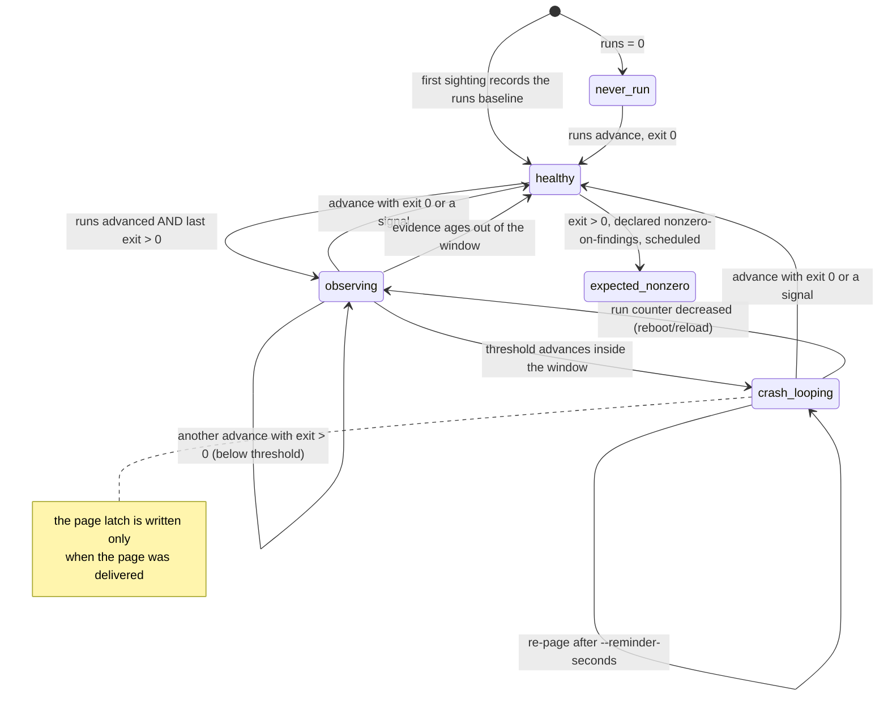

# launchd crash-loop watch

`launchd-crash-loop-watch` finds launchd jobs that exit non-zero over and over. **macOS /
launchd only** for collection (`launchctl list`, `launchctl print`); the evaluation is pure and
tested with captured `launchctl print` artifacts.

```bash
launchd-crash-loop-watch --label-prefix com.example.                      # this machine, silent if healthy
launchd-crash-loop-watch --label-prefix com.example. --show-all           # always print the report
launchd-crash-loop-watch --label-prefix com.example. --json               # JSON report only, every run
launchd-crash-loop-watch --label-prefix com.example. --host other-mac     # this machine plus a remote
launchd-crash-loop-watch --label-prefix com.example. --host other-mac --remote-only
```

Exit: `0` complete coverage (a crash loop that was successfully paged also exits 0, see below),
`1` crash loops with `--fail-on-crash-loop`, `2` bad arguments, `3` UNKNOWN (any job or host could
not be measured, state unreadable, or an alert failed to deliver).

## What counts as a crash loop



A job whose `launchctl print` cannot be read or parsed is `unknown` (exit 3) in any state, and
its previous evidence is kept rather than reset.

- The unit of evidence is a **distinct advance of launchd's `runs` counter** with a positive
  `last exit code`. A job sampled ten times between two runs contributes one observation, not ten.
- `--threshold` (default 3) observations inside `--window-seconds` (default 600) is a loop.
- An exit of 0 or a signal (a deliberate `launchctl kickstart -k` sends SIGTERM) ends the pattern.
- A decreasing run counter means launchd reloaded the job; history resets.
- `runs = 0` is `never_run`, not a failure.
- A **periodic** job whose contract is to exit non-zero when it finds something can be declared
  with `--nonzero-findings-label LABEL`. The exemption applies only if launchd shows the job has
  a schedule (`run interval` or event triggers); declared on an always-on service, it is ignored.

## Reminders: an incident that never ends must not go quiet

The first page latches `incident_alerted`. The latch clears only on recovery, a counter reset, or
the evidence window emptying, none of which a permanent loop produces. Without a reminder, the
first page would also be the last. `--reminder-seconds` (default 6h) re-pages while it continues;
`0` restores alert-once.

The latch and its timestamp are written **only on delivered pages**. A failed page leaves the
incident pending, and the error record carries each sink's failure reason: this record is the
only artifact a failed delivery produces.

## Remote hosts

`--host NAME` (repeatable) reads another Mac's inventory over `ssh -o BatchMode=yes`, so alert
credentials stay on the watcher. `--remote-only` skips the local pass, for a dedicated job per
remote that should not re-classify the watcher's own jobs.

- Findings are host-qualified (`other-mac/com.example.job`), pages name the host, and dedupe keys
  include it: two machines running the same label keep separate baselines and separate pages.
- A host that cannot be reached (or whose every `launchctl print` fails after listing succeeds)
  is UNKNOWN, exits 3 whatever the rest looks like, and pages at `critical`.
- A failed tick **preserves** that host's evidence. Otherwise a host whose ssh fails every other
  tick could never accumulate enough observations to reach the threshold.

## Exit 0 after a successful page

By default a detected loop that was paged successfully exits 0. The watch is itself a launchd
job, and a watcher that exits non-zero every run whenever anything else is broken would look
like a crash loop of its own. Use `--fail-on-crash-loop` in contexts where the exit code is the
signal. UNKNOWN is still `3` either way.

## State

`~/.local/state/honest-watchdogs/launchd-crash-loop-watch.json`, written atomically with mode
0600. A corrupt or unreadable state file is **not** silently replaced, in local or `--host` mode:
every job becomes UNKNOWN and the run exits 3 until it is fixed, because an empty baseline would
quietly restart every evidence window.
