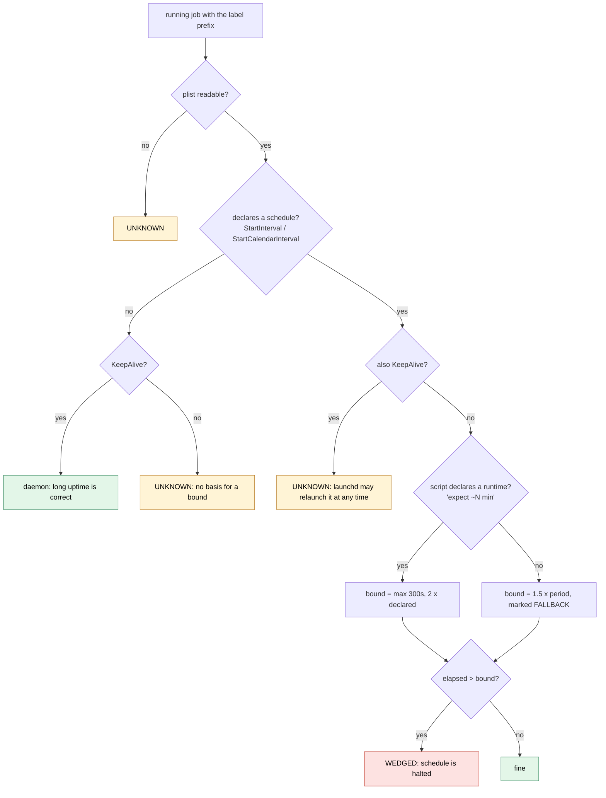

# launchd wedge watch

`launchd-wedge-watch` finds scheduled one-shot jobs whose current run has outlived its own
schedule. **macOS / launchd only** for collection; classification is pure Python.

```bash
launchd-wedge-watch --label-prefix com.example.          # human output
launchd-wedge-watch --label-prefix com.example. --json   # machine output
launchd-wedge-watch --label-prefix com.example. --no-alert
```

Exit: `0` nothing wedged, `1` at least one wedged, `2` no prefix given, `3` something could not be
classified (UNKNOWN outranks wedged).

Zero *running* jobs is normal between runs and reads as clean. Zero *loaded* jobs matching the
prefix is UNKNOWN: a typo in `--label-prefix` must not look like a clean survey.

A running job whose runtime cannot be measured is UNKNOWN too. `ps -p PID` exiting 1 with no
output means the process finished between the listing and the probe, which is not a fault; any
other failure (a timeout, a missing `ps`, unparseable output) makes that job UNKNOWN rather than
dropping it from the survey.

## The problem

launchd does not start a second instance of a job while one is running. A hung scheduled job
therefore halts its schedule rather than delaying one run, and nothing reports it:
`launchctl list` shows the job loaded with `LastExitStatus 0`, which describes the last run that
finished.

Uptime cannot find it either. Daemons (`KeepAlive`) are supposed to run for weeks, so "alive for
16 hours" is healthy for one job and a wedge for the one next to it.

## Classification



Bounds are capped at 24 hours.

### Where the period comes from

- `StartInterval`: that many seconds.
- `StartCalendarInterval`: the smallest gap between declared times, wrapping midnight. An entry
  with only `Minute` is hourly. Any entry with `Day`, `Weekday` or `Month` uses the daily ceiling.

Never from observed run times. A bound derived from how long the job has been running would let
a stuck job enlarge its own bound.

### A declared runtime beats a cadence

A cadence says how often work *starts*, not how long it takes. A daily job gets a 24-hour cadence
bound even if it normally finishes in ten minutes, so a hang could halt it for a day before a
cadence-based check notices. If the job's script contains a line such as

```bash
echo "=== nightly export starting (expect ~10 min) ==="
```

the bound becomes twice that, with a five-minute floor. The watch reads the **script** named in
`ProgramArguments` (the first `.py`, `.sh`, `.js` or `.ts` argument), not the interpreter before
it. An unreadable script falls back to the cadence; it never reads as a zero-second runtime.

A finding based on the fallback says `FALLBACK` in its detail, so a weak bound is visibly weak.

## Alerting

Each finding is alerted at most once per six hours per `(kind, label)`. The re-nag timestamp is
recorded only when the alert was **delivered**; a failed delivery stays due on the next run. The
state file defaults to `~/.local/state/honest-watchdogs/launchd-wedge-watch.json` and is read
on every alerting run. If it exists but cannot be parsed, the run exits 3, the file is left
untouched, and findings are alerted without latching.

## Scheduling it

Run it every five minutes from its own LaunchAgent. It exits non-zero when it finds something,
which launchd records but does not act on for a job with `StartInterval` and no `KeepAlive`.
