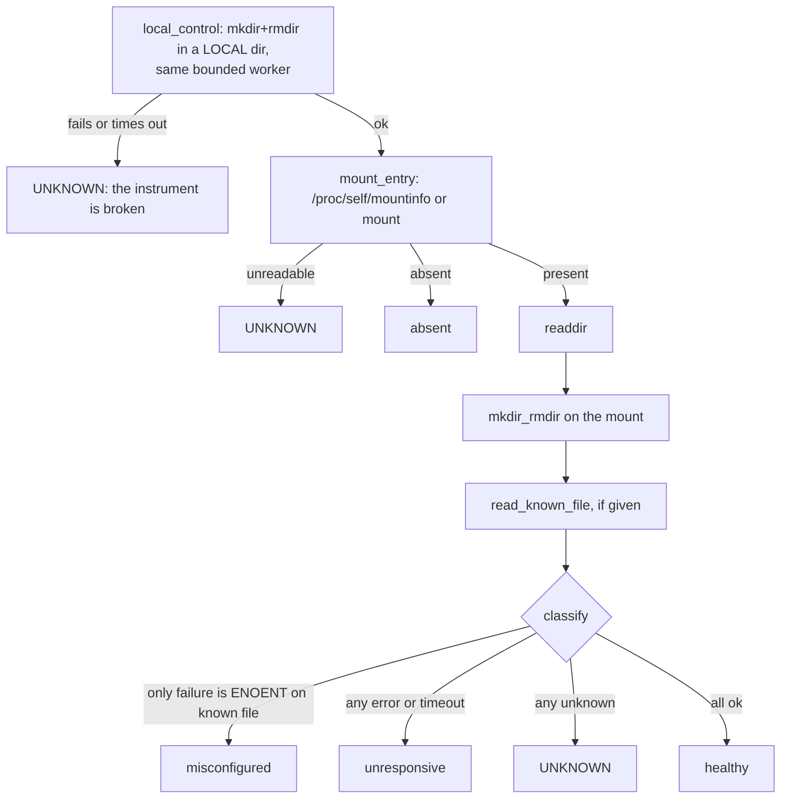

# Mount probe

`mount-probe` decides whether a mounted filesystem is actually serving I/O. **POSIX (macOS and
Linux).** It prints one JSON line and one human line, and optionally attempts a bounded
remount.

```bash
mount-probe --mount-point /mnt/share
mount-probe --mount-point /mnt/share --known-file status/heartbeat.txt --timeout 5
mount-probe --mount-point /mnt/share --read-only          # no write probe; coverage reduced and recorded
mount-probe --mount-point /mnt/share --json               # the JSON line only
mount-probe --mount-point /mnt/share --remediate --mount-command 'mount /mnt/share'
```

Exit: `0` healthy, `1` absent / unresponsive / remediation failed, `2` misconfigured (the mount
answers but `--known-file` does not exist), `3` UNKNOWN.

## Why not `ls`?

| Check | What it proves |
|---|---|
| mount table entry | the kernel thinks something is mounted there |
| `ls` / `readdir` | *something* answered, possibly the client's attribute and directory cache |
| create and remove a directory | the server accepted a write, inside a deadline |
| read a known file | content, not just metadata, is readable |

A network mount whose server has gone away can stay in the mount table, keep answering listings
from cache for a while, and then block the first `open()` indefinitely. The block does not raise,
so `try/except` cannot catch it, and a thread cannot interrupt it.

## How each probe is bounded

Each operation runs in a **fresh Python interpreter in its own process group** (`python -m
honest_watchdogs.mount_probe --_mount-probe-worker ...`), communicating one JSON line back. At the
deadline the whole group is SIGKILLed, and the parent never waits unboundedly for it afterwards:
a process in uninterruptible sleep on a dead mount may not die promptly.

## The local positive control



Before touching the mount, the probe runs the **same** write operation through the **same**
bounded-subprocess machinery against a local directory (`--control-dir`, default the system temp
directory). If that fails (no subprocesses allowed, a sandbox, a full disk, a broken
interpreter), the probe has not shown it can observe a healthy write, so it cannot call the mount
unhealthy: the verdict is UNKNOWN and no mount probe runs. `--no-control` skips it.

## Classification details

- **Absent** is decided only from a readable mount table. An empty, unreadable or malformed
  mount table is UNKNOWN, never "absent".
- **Misconfigured, not unresponsive.** If the only failure is `ENOENT` on `--known-file` while
  `readdir` and the write both passed, the mount has demonstrated that it serves I/O; the file was
  renamed or never created. This matters because `unresponsive` arms the force-unmount path, and
  a renamed file must not tear down a healthy mount.
- A crashed probe worker is UNKNOWN, never healthy.

## Remediation (opt-in)

`--remediate --mount-command CMD` attempts up to `--remediation-attempts` (1 to 3) recoveries:

1. Re-probe. If the mount recovered, stop. If the fresh probe is anything other than `absent` or
   `unresponsive`, **refuse** any destructive action.
2. For an unresponsive mount: prove the parent directory is writable (some unmount tools delete
   the mount point), else require `--recreate-command`; then run `--unmount-command` (default
   `diskutil unmount force` on macOS, `umount -f` on Linux).
3. Ensure the mount point exists, recreating it directly or with `--recreate-command`.
4. Run `--mount-command`, then re-probe. An UNKNOWN re-probe stops further attempts.

Every action, its exit code, output and duration is recorded in the report. Commands are parsed
without a shell and may contain `{mount_point}`.

## Coverage is named, not implied

The report includes `coverage.tested_binary`: every probe ran under one interpreter. Where file
access is granted per binary (for example macOS privacy controls), a healthy verdict says nothing
about whether another program can use the mount; one ungranted binary fails instantly, another can
block forever. Every human line, including the misconfiguration line, ends with
`tested_binary=... coverage=one-binary-only`, so a scoped pass is not read as a general one.
`--json` prints only the JSON report, which carries the same `coverage` object.
