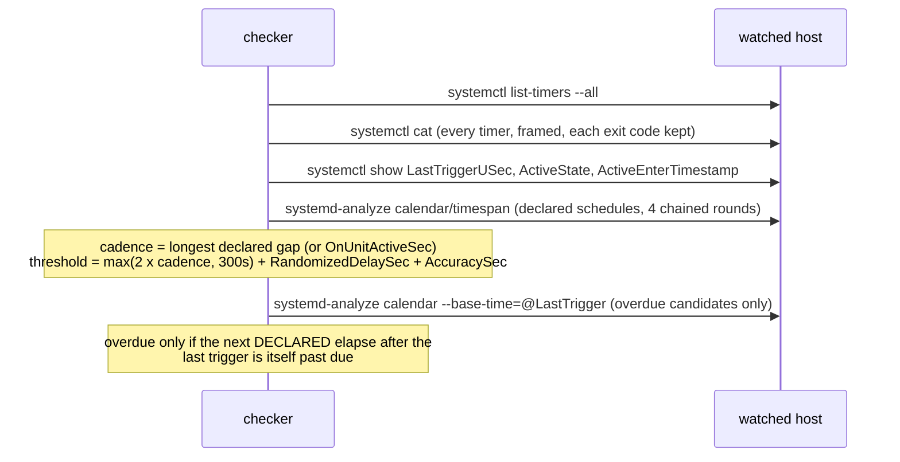

# systemd timer liveness

`systemd-timer-liveness` sweeps every systemd timer on a machine and reports the ones that have
stopped firing. **Linux / systemd only** (`systemctl`, `systemd-analyze`). It runs locally, or
against another machine with `--host` over `ssh -o BatchMode=yes`.

```bash
systemd-timer-liveness                      # this machine
systemd-timer-liveness --host db1 --json    # another machine
systemd-timer-liveness --host db1 --dry-run # no alerts, no state
```

Exit: `0` all live (inactive timers are listed, not paged), `1` overdue or never fired, `3`
UNKNOWN.

**Run it from a different machine than the one it checks.** A checker on the watched machine
shares the failure domain it exists to report: if the machine is down, so is the checker.

## Pipeline



## Three rules

### 1. Cadence comes from the declaration

The cadence is computed from `OnCalendar=` and `OnUnitActiveSec=` as written, read with
`systemctl cat` so drop-ins are included. An empty assignment (`OnCalendar=`) resets the trigger
list, exactly as systemd does, so the common override shape

```ini
[Timer]
OnCalendar=daily
# drop-in
[Timer]
OnCalendar=
OnCalendar=hourly
```

is hourly, not daily-and-hourly.

`systemd-analyze calendar --iterations=3` is chained four times from the last resolved elapse,
giving twelve consecutive declared elapses. Three alone can alias: on a Sunday, `Mon..Fri 09:30`
yields Mon/Tue/Wed and hides the weekend gap. The **longest** gap is the cadence, so a
first-Sunday-of-the-month timer is judged on its 35-day gap, not its 28-day one.

`systemd-analyze` is never piped (a pipe masks its exit code), and its "Failed to parse" text is
checked as a second guard. A schedule that cannot be resolved is UNKNOWN.

Timers with only `OnBootSec=` / `OnActiveSec=` have no recurring schedule and are UNKNOWN: there
is no declared cadence to measure against.

### 2. An empty LastTrigger has three meanings

| `LastTriggerUSec` | `ActiveState` | Meaning | Verdict |
|---|---|---|---|
| empty | absent | could not read it | UNKNOWN |
| empty | not `active` | the timer unit is not running | listed as *inactive*, not paged |
| empty | `active`, entered recently | not reached its first elapse | OK |
| empty | `active`, entered long ago | active and has never fired | FINDING (`never_fired`) |

Collapsing these into "cannot measure" turns every freshly installed timer into a warning every
run, which gets muted.

### 3. Overdue is confirmed against the calendar, from the last trigger

A timer declared `Mon..Fri *-*-* 12..21:*:00` has a 60-second cadence. At 22:05 the cadence
arithmetic says it is late. It is not: the next declared elapse after its last trigger (21:59) is
12:00 on the next weekday.

So every overdue candidate with an `OnCalendar=` is re-resolved with
`--base-time=@<LastTrigger>`, and it stays a finding only if that next declared elapse is itself
past due by more than the grace. An ancient `LastTrigger` produces an ancient due time, so a real
outage still fires. If the re-resolution fails for any reason, the finding is kept: this step can
only remove a false alarm, never hide a real one.

## Alerting and state

Findings and unknowns are alerted with a host-qualified dedupe key
(`systemd-timer-liveness/<kind>/<host>/<unit>`), re-alerted after `--reminder-seconds` (6h) while
they persist, and latched only on successful delivery. A transport failure preserves existing
latches: one ssh blip must not reset the reminder clock for a timer that is still overdue.

A state file that exists but cannot be parsed (or whose `alerted` map is malformed) makes the run
exit 3 whatever the sweep found. The file is left untouched and alerts go out unlatched.
